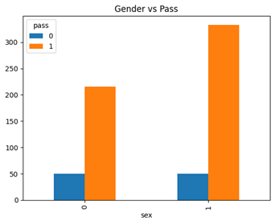
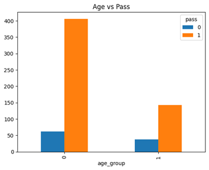
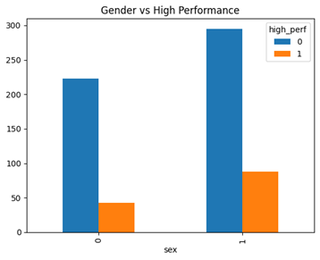
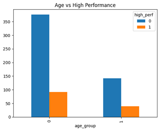

# AI Fairness in Educational Systems  
### Evaluating Bias in Student Outcome Prediction

Machine learning systems are increasingly used in domains such as education to predict outcomes like academic success, dropout risk, or eligibility for opportunities. However, these systems can encode and amplify existing inequalities present in the data.

This project examines how algorithmic fairness behaves in predicting student outcomes, with a focus on how fairness metrics interact with real-world data distributions and decision definitions.

---

## Overview

The analysis uses the Student Performance dataset (Portuguese education system) to evaluate how protected attributes influence model outcomes.

- Domain: Education  
- Observations: 649 students  
- Protected classes: Gender, Age  
- Outcomes:
  - Pass/Fail  
  - High Performance  

📄 Full report: [View Report](./report.pdf)

---

## Methodology

The project follows a structured fairness evaluation pipeline:

1. Define outcome variables (Pass/Fail, High Performance)  
2. Identify protected classes (Gender, Age)  
3. Compute fairness metrics:
   - Disparate Impact (DI)  
   - Statistical Parity Difference (SPD)  
4. Apply bias mitigation (resampling / rebalancing)  
5. Train classifier and evaluate post-mitigation fairness  

---

## Scenario Analysis

### Distribution Across Groups

#### Gender vs Pass

#### Age vs Pass

#### Gender vs High Performance

#### Age vs High Performance

---

## Key Findings

- **Fairness metrics showed minimal improvement after mitigation**  
  Rebalancing the dataset did not significantly change fairness outcomes, suggesting that distribution-level corrections alone may be insufficient.

- **Bias mitigation effects vary across groups**  
  Fairness improved slightly for age-based groups but worsened for gender in certain cases.

- **Model training did not eliminate bias**  
  Fairness metrics remained largely unchanged after training, indicating that bias present in the dataset persists through the model.

- **Outcome definition influences fairness results**  
  Changing how “success” is defined (pass vs high performance) leads to different fairness outcomes, highlighting the sensitivity of fairness metrics to label design.

---

## Key Takeaways

- Fairness is not guaranteed by applying standard mitigation techniques  
- Metrics such as DI and SPD provide signals, not solutions  
- Bias can persist even when datasets appear balanced  
- Real-world deployment requires deeper consideration beyond statistical parity  

---

## Code

Jupyter Notebook:  
[View Notebook](./notebook.ipynb)
